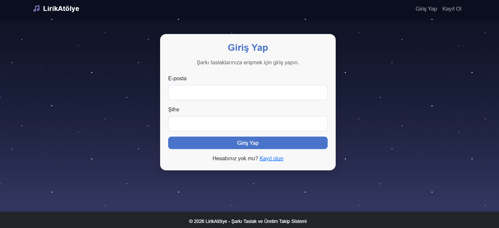
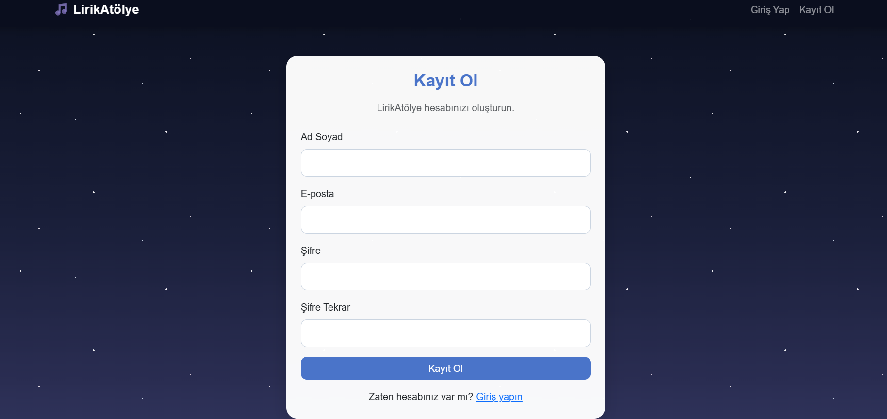
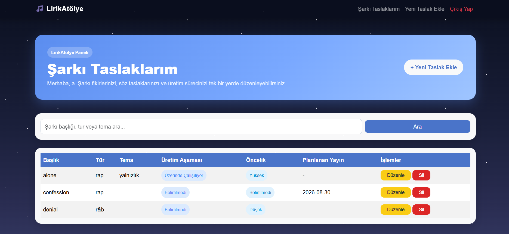
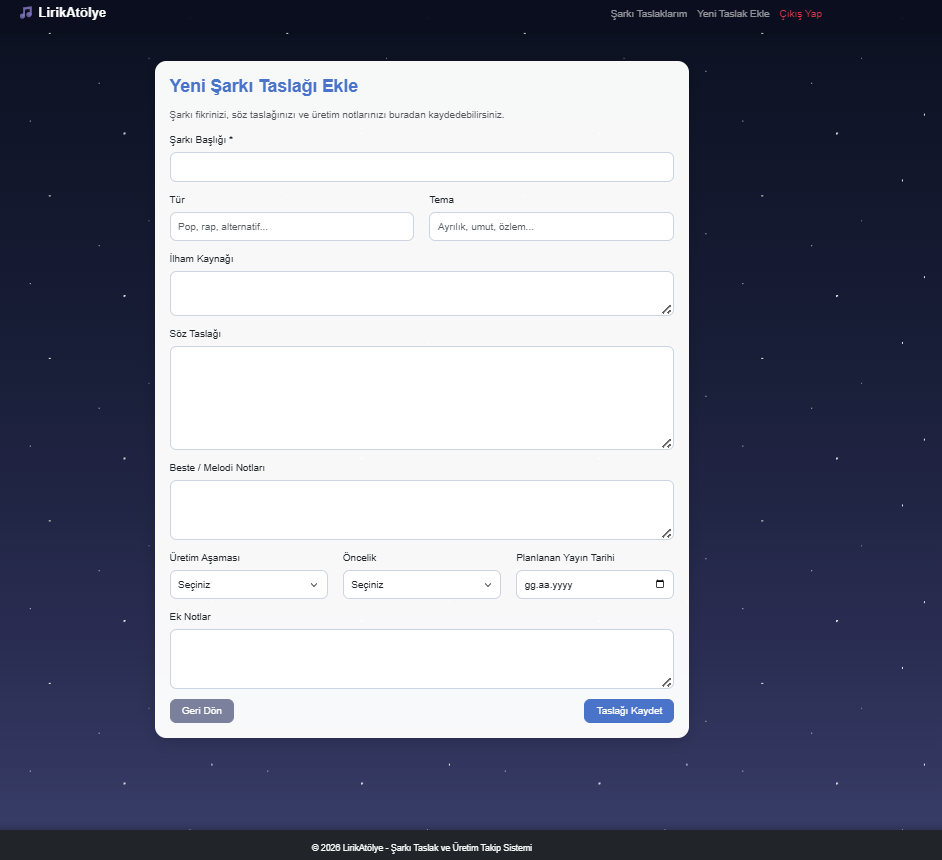

# 🎵 LirikAtölye

<div align="center">

## Şarkı Taslağı Takip Sistemi

### Şarkı taslaklarını kaydet, düzenle, ara ve takip et.

</div>

---

## 📌 Proje Hakkında

**LirikAtölye**, PHP ve MySQL kullanılarak geliştirilmiş web tabanlı bir şarkı taslağı takip sistemidir.

Kullanıcılar sisteme kayıt olabilir, güvenli şekilde giriş yapabilir ve kendi şarkı taslaklarını kaydedebilir. Eklenen şarkı taslakları listelenebilir, aranabilir, düzenlenebilir ve silinebilir.

Bu proje, şarkı fikirlerini ve taslaklarını düzenli şekilde saklamak isteyen kullanıcılar için geliştirilmiştir.

---

## 🎯 Projenin Kapsamı

Bağımsız sanatçılar ve şarkı yazarları için üretim süreci çoğu zaman dağınık notlar, yarım kalan sözler, telefon notlarına yazılmış fikirler ve unutulan melodilerden oluşur. LirikAtölye, bu yaratıcı süreci daha düzenli hale getirmek amacıyla geliştirilmiş bir şarkı taslağı takip sistemidir.

Uygulama sayesinde kullanıcılar yalnızca şarkı adı kaydetmekle kalmaz; tür, tema, ilham kaynağı, söz taslağı, beste notları, üretim aşaması, öncelik durumu ve planlanan yayın tarihi gibi bilgileri de tek bir panel üzerinden yönetebilir.

Bu yönüyle LirikAtölye, bağımsız müzisyenlerin ve söz yazarlarının fikir aşamasındaki çalışmalarını kaybetmeden takip edebileceği kişisel bir üretim alanı sunar.

---

## 🎯 Projenin Amacı

Bu uygulamanın amacı:

- Kullanıcıların kendi hesaplarını oluşturabilmesi
- Şarkı taslaklarını güvenli şekilde kaydedebilmesi
- Kaydedilen taslakları listeleyebilmesi
- Taslaklar arasında arama yapabilmesi
- Var olan kayıtları düzenleyebilmesi
- İstenilen kayıtları silebilmesi

---

## ✨ Özellikler

- Kullanıcı kaydı
- Güvenli giriş ve çıkış
- Şifrelerin hashlenerek saklanması
- Session ile oturum yönetimi
- Şarkı taslağı ekleme
- Şarkı taslaklarını listeleme
- Şarkı taslakları arasında arama yapma
- Şarkı taslağı düzenleme
- Şarkı taslağı silme
- Bootstrap ile responsive arayüz

---

## 🖼️ Ekran Görüntüleri

### Giriş Sayfası



### Kayıt Sayfası



### Şarkı Taslakları Sayfası



### Yeni Taslak Ekleme Sayfası



---

## 🛠️ Kullanılan Teknolojiler

Bu proje temel web teknolojileri kullanılarak geliştirilmiştir:

- **PHP**
- **MySQL / MariaDB**
- **HTML5**
- **CSS3**
- **Bootstrap 5**
- **PDO**

---

## 🗄️ Veritabanı Yapısı

Projede iki temel tablo bulunmaktadır:

| Tablo | Açıklama |
|---|---|
| `users` | Kullanıcı bilgilerini tutar |
| `song_projects` | Kullanıcılara ait şarkı taslaklarını tutar |

### `users` Tablosu

| Alan | Açıklama |
|---|---|
| `id` | Kullanıcı ID değeri |
| `name` | Kullanıcının adı |
| `email` | Kullanıcının e-posta adresi |
| `password` | Hashlenmiş kullanıcı şifresi |
| `created_at` | Kayıt tarihi |

### `song_projects` Tablosu

| Alan | Açıklama |
|---|---|
| `id` | Şarkı taslağı ID değeri |
| `user_id` | Kaydı oluşturan kullanıcı ID değeri |
| `title` | Şarkı başlığı |
| `genre` | Şarkı türü |
| `theme` | Şarkı teması |
| `inspiration` | İlham kaynağı |
| `lyrics_draft` | Söz taslağı |
| `composition_notes` | Beste / melodi notları |
| `production_stage` | Şarkı taslağının aşaması |
| `priority_level` | Öncelik durumu |
| `planned_release_date` | Planlanan yayın tarihi |
| `notes` | Ek notlar |
| `created_at` | Oluşturulma tarihi |

---

## 🧭 Sayfa Yapısı

| Dosya | Görevi |
|---|---|
| `index.php` | Kullanıcıyı giriş durumuna göre yönlendirir |
| `register.php` | Kullanıcı kayıt işlemini yapar |
| `login.php` | Kullanıcı giriş işlemini yapar |
| `logout.php` | Oturumu sonlandırır |
| `dashboard.php` | Şarkı taslaklarını listeler ve arama yapar |
| `song_add.php` | Yeni şarkı taslağı ekler |
| `song_edit.php` | Var olan şarkı taslağını düzenler |
| `song_delete.php` | Şarkı taslağını siler |
| `config/database.php` | Veritabanı bağlantısını içerir |
| `includes/auth.php` | Oturum kontrolü yapar |
| `includes/header.php` | Ortak üst menü alanıdır |
| `includes/footer.php` | Ortak alt bilgi alanıdır |
| `assets/style.css` | Özel CSS düzenlemelerini içerir |

---

## 🚀 Kurulum ve Çalıştırma

Projeyi kendi bilgisayarınızda çalıştırmak için:

### 1. Projeyi XAMPP klasörüne taşıyın

Proje klasörünü XAMPP içindeki `htdocs` klasörüne kopyalayın.

```text
C:\xampp\htdocs\lirik_atolye
```

### 2. Apache ve MySQL servislerini başlatın

XAMPP Control Panel üzerinden Apache ve MySQL servislerini başlatın.

### 3. phpMyAdmin panelini açın

Tarayıcıdan şu adrese gidin:

```text
http://localhost/phpmyadmin
```

### 4. Veritabanını oluşturun

phpMyAdmin üzerinden önce `lirik_atolye` adında bir veritabanı oluşturun. Daha sonra bu veritabanını seçerek `database.sql` dosyasını içe aktarın.

### 5. Veritabanı bağlantısını düzenleyin

`config/database.php` dosyasındaki bilgileri kendi ortamınıza göre düzenleyin.

```php
$host = "localhost";
$dbname = "lirik_atolye";
$username = "root";
$password = "";
```

### 6. Projeyi tarayıcıda açın

```text
http://localhost/lirik_atolye
```

---

## 📖 Proje Kullanımı

1. Kullanıcı sisteme kayıt olur.
2. Kayıt olduktan sonra giriş yapar.
3. Yeni şarkı taslağı ekler.
4. Kendi şarkı taslaklarını listeler.
5. Şarkı taslakları arasında arama yapar.
6. İstediği taslağı düzenler.
7. İstediği taslağı siler.
8. İşlem sonunda çıkış yapar.

---

## 🚀 Geliştirme Alanları

Proje temel kullanıcı işlemleri ve şarkı taslağı yönetimi üzerine kurulmuştur. İlerleyen süreçte uygulama daha kapsamlı hale getirilerek aşağıdaki özellikler eklenebilir:

- Şarkı taslaklarını üretim aşamasına veya öncelik durumuna göre filtreleme
- Kullanıcı panelinde toplam taslak sayısı ve tamamlanan çalışma sayısı gibi özet bilgilerin gösterilmesi
- Her şarkı taslağı için ayrı bir detay görüntüleme sayfası oluşturulması
- Kullanıcıların taslaklarına kapak görseli veya ses dosyası ekleyebilmesi
- Arayüzün mobil kullanım için daha gelişmiş hale getirilmesi

---

## 🔒 Güvenlik Özellikleri

- Kullanıcı şifreleri veritabanına düz metin olarak kaydedilmez.
- Şifreler `password_hash()` fonksiyonu ile hashlenir.
- Giriş kontrolünde `password_verify()` kullanılır.
- Oturum kontrolü PHP `session` yapısı ile yapılır.
- Kullanıcılar sadece kendi şarkı taslaklarını görüntüleyebilir.
- Düzenleme ve silme işlemlerinde `user_id` kontrolü yapılır.

---


## 🎥 Tanıtım Videosu

Proje tanıtım videosu bağlantısı:

https://youtu.be/0d7hdz8sV08

---

## 👩‍💻 Geliştirici

**Nazife Sude CAN**

Bu proje bireysel olarak Web Tabanlı Programlama dersi kapsamında geliştirilmiştir.
